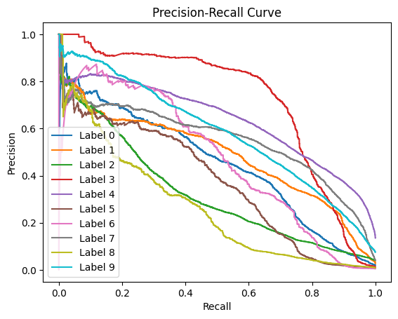
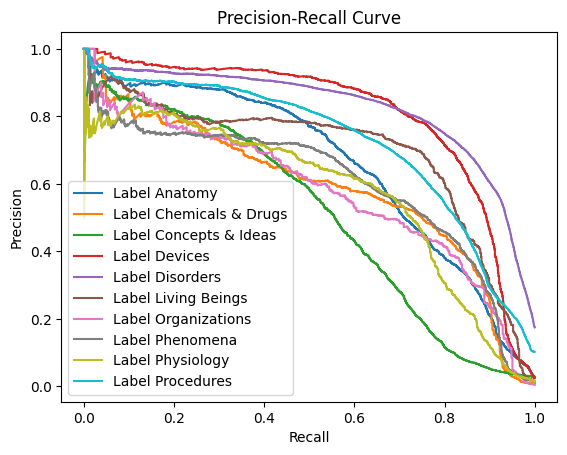

# Clinical Named Entity Recognition in the Portuguese Language: A Benchmark of Modern BERT Models and LLMs

This repository contains the source code and experimental setup for the research paper "Clinical named entity recognition in the Portuguese language: a benchmark of modern BERT models and LLMs".

## 1. Abstract

Clinical notes hold valuable unstructured information, yet benchmarks for Named Entity Recognition (NER) in Portuguese remain scarce. This study evaluates BERT models and Large Language Models (LLMs) for clinical NER in Portuguese and tests strategies to address multilabel imbalance.

We compared BioBERTpt, BERTimbau, ModernBERT, and mmBERT with LLMs such as GPT-5 and Gemini-2.5, using the public SemClinBr corpus and a private breast-cancer dataset. Models were trained under identical conditions and evaluated with precision, recall, and F1-scores.

Key Findings:
- mmBERT-base achieved the best results (micro $F1=0.76$), outperforming other models in the SemClinBr.
- Both BioBERTpt and mmBERT performed well on the private breast cancer dataset.
- Iterative stratification improved class balance and overall performance.
- Multilingual BERT models perform strongly for Portuguese clinical NER and offer the advantage of running locally with limited resources when compared to LLMs.
- Data contamination cannot be excluded in the case of mmBERT models.

## 2. How to use this repository

### Prerequisites

Before setting up the environment, ensure you have the following installed:

- **Python** `>= 3.12`
- **Git**
- **`uv`** for dependency management. [Install uv](https://docs.astral.sh/uv/getting-started/installation/)
- (Optional) **CUDA** compatible with the PyTorch wheels if you plan to use a GPU

All project dependencies are declared in `pyproject.toml` and their resolved versions are available in `uv.lock`.

### Installation and environment setup

This section explains how to prepare a local environment (Windows PowerShell) to run the repository scripts and models using `uv`.

#### Step 1: Clone the repository

```powershell
git clone <repo-url>
cd .\clinical_ner_benchmark_paper\clinical_ner_benchmark_paper
```

#### Step 2: Sync dependencies with `uv`

```powershell
uv sync
```

This command creates a virtual environment and installs all dependencies from `pyproject.toml` and `uv.lock`.

#### Step 3: Install PyTorch (choose according to your machine)

**Example (CUDA 12.8 — adjust according to your CUDA version):**

```powershell
uv pip install --index-url https://download.pytorch.org/whl/cu128 torch==2.9.0 torchvision==0.24.0 torchaudio==2.9.0
```

**Example (CPU-only):**

```powershell
uv pip install --index-url https://download.pytorch.org/whl/cpu torch==2.9.0 torchvision==0.24.0 torchaudio==2.9.0
```

See https://pytorch.org/get-started/locally/ for the correct command for your setup.


**Running the tests**

- **Scripts:** Use `./scripts/run_tests.ps1` (Windows PowerShell) or `./scripts/run_tests.sh` (Linux/macOS) to create a virtual environment, install a minimal set of test dependencies and run `pytest`.
- **Activate `venv`:** PowerShell: `& .\.venv\Scripts\Activate.ps1` then run `pytest -q` to execute the test suite interactively.
- **Smoke tests (optional):** These tests require heavy ML libraries (PyTorch, `transformers`). Install them before running smoke tests. Example CPU-only install: `uv pip install --index-url https://download.pytorch.org/whl/cpu torch==2.9.0 torchvision==0.24.0 torchaudio==2.9.0` and `uv pip install transformers`. Run `pytest tests/test_model_smoke.py` to run only the smoke tests.
- **Without `uv` (alternative):** Create a venv manually: `python -m venv .venv; & .\.venv\Scripts\Activate.ps1; python -m pip install -U pip setuptools wheel` then install `pytest` and any other dependencies you need.
- **CI:** A GitHub Actions workflow is provided at `.github/workflows/ci-tests.yml` and runs the minimal test set on push/pull requests.

### Running scripts and notebooks

After environment setup, run scripts and notebooks using `uv run`:

```powershell
uv run python examples/dummy_data_example.ipynb
uv run python benchmark/run_benchmark.py
```

### Quick example: Using the bundled fake dataset

To learn how to use the `spesia_ner` package classes and functions, open and run the example notebook:

```
examples/dummy_data_example.ipynb
```

This notebook demonstrates:
- Loading the bundled dummy dataset (`data/dummy_data/fake_data.jsonl`)
- Creating `ClinicalRecordsDataset` objects with different annotation schemes (IO and BIO)
- Splitting data into train/val/test sets using iterative stratification
- Integrating HuggingFace tokenizers
- Accessing tokenized samples and computing label statistics
- Exporting datasets to different formats

All operations in this notebook use the fake data, making it fully reproducible without requiring access to private clinical datasets.

The repository includes filename sanitization to avoid common Windows path issues.

### Accessing datasets

#### SemClinBr dataset

Request access to the SemClinBr dataset following the official documentation.

## 3. How to reproduce the study results

## Perguntas de pesquisa

Quais as técnicas com melhor performance para extração de entidades clínicas no contexto da oncologia?

Qual a relação dessas técnicas e o custo envolvido em seu uso em ambientes de produção?

Existe benefício em performance e custo ao se desenvolver modelos proprietários?

É possível treinar LLMs para expandir datasets com entidades ao utilizá-los para anotar dados novos?

É possível usar modelos BERT genéricos para facilitar anotação de datasets em domínios específicos?

É possível utilizar LLMs para expandir datasets com dados sintéticos e melhorar a performance dos extratores?

## Modelos

### Modelos BERT
- **mmBERT**

    Modelo do tipo encoder multilingue e melhor representação de línguas com menos recursos.
    https://huggingface.co/blog/mmbert

- **ModernBERT**

    https://huggingface.co/docs/transformers/model_doc/modernbert

- **BioBERTpt**

    https://github.com/HAILab-PUCPR/BioBERTpt

- **BERTimbau**

    https://huggingface.co/neuralmind/bert-base-portuguese-cased


### Modelos Generativos
...

## Datasets

### SemClinBr

Distribuição dos grupos semânticos da UMLS (Unified Medical Language System):

| Grupo semântico                        | Número de notas clínicas |
|---------------------------------------:|---------:|
| Procedures                            |      984 |
| Disorders                             |      979 |
| Concepts & Ideas                      |      887 |
| Living Beings                         |      715 |
| Anatomy                               |      705 |
| Chemicals & Drugs                     |      601 |
| Physiology                            |      566 |
| Phenomena                             |      492 |
| Devices                               |      416 |
| Organizations                         |      348 |
| Objects                               |      122 |
| Activities & Behaviors                |       36 |
| Genes & Molecular Sequences           |        1 |
| Occupations                           |        1 |
| Geographic Areas                      |        0 |

Dos 15 grupos, os últimos 3 não são viáveis para treino e avaliação de modelos, visto que não existem exemplos suficientes no dataset.

## Experimentos

### 1. Performance na extração de grupos semânticos do SemClinBr

| Modelo                                 | Tipo de anotação | Macro-F1   | Micro-F1   |
|:----------------------                 |-----------------:|---------:  |---------:  |
| **BioBERTpt**                          |                  |            |            |
| pucpr/biobertpt-all                    | IO               | 0.6443     | 0.6830     |
| pucpr/biobertpt-all                    | BIO              | 0.6207     | 0.6573     |
| pucpr/biobertpt-clin                   | IO               | 0.6489     | 0.6981     |
| pucpr/biobertpt-clin                   | BIO              | 0.6470     | 0.6959     |
| pucpr/biobertpt-bio                    | IO               | 0.5839     | 0.6548     |
| pucpr/biobertpt-bio                    | BIO              | 0.5543     | 0.6208     |
|                                        |                  |            |            |
| **mmBERT**                             |                  |            |            |
| jhu-clsp/mmBERT-base                   | IO               | 0.7023     | 0.7331     |
| jhu-clsp/mmBERT-base                   | BIO              | 0.4137     | 0.7537     |
| jhu-clsp/mmBERT-base<sup>1</sup>       | IO               | 0.7098     | 0.7589     |
| jhu-clsp/mmBERT-base<sup>1</sup>       | BIO              | 0.4217     | 0.7567     |
| jhu-clsp/mmBERT-base<sup>2</sup>       | IO               | **0.7234** | **0.7721** |
| jhu-clsp/mmBERT-base<sup>2</sup>       | BIO              | 0.4201     | 0.7437     |
| jhu-clsp/mmBERT-small                  | IO               | 0.6667     | 0.7264     |
| jhu-clsp/mmBERT-small                  | BIO              | 0.3968     | 0.7055     |
|                                        |                  |            |            |
| **ModernBERT**                         |                  |            |            |
| answerdotai/ModernBERT-base            | IO               | 0.5475     | 0.6494     |
| answerdotai/ModernBERT-base            | BIO              | 0.2277     | 0.5654     |
| answerdotai/ModernBERT-large           | IO               | 0.5895     | 0.6987     |
| answerdotai/ModernBERT-large           | BIO              | 0.3258     | 0.6851     |
|                                        |                  |            |            |
| **BERTimbau**                          |                  |            |            |
| neuralmind/bert-base-portuguese-cased  | IO               | 0.5839     | 0.6592     |
| neuralmind/bert-base-portuguese-cased  | BIO              | 0.5000     | 0.6094     |
| neuralmind/bert-large-portuguese-cased | IO               | 0.5769     | 0.6421     |
| neuralmind/bert-large-portuguese-cased | BIO              | 0.6264     | 0.6474     |

<sup>1</sup> Models trained with clamped weighted loss.

<sup>2</sup> Models trained with clamped (`min=1.0`) and scaled (`begin_token_weight_scaler=2.0`) weighted loss.


| Modelo                                 | Tipo de prompt   | Macro-F1   | Micro-F1   |
|:----------------------                 |-----------------:|---------:  |---------:  |
| **Gemini**                             |                  |            |            |
| gemini-2.5-flash-lite                  | Few-shot         | 0.4849     | 0.5781     |
| gemini-2.5-flash                       | Few-shot         | 0.5965     | 0.6528     |
| gemini-2.5-pro                         | Few-shot         | 0.5965     | 0.6528     |
|                                        |                  |            |            |
| **OpenAI**                             |                  |            |            |
| gpt-4.1                                | Few-shot         | 0.4795     | 0.5328     |
| gpt-5-mini minimal<sup>1</sup>         | Few-shot         | 0.4489     | 0.4746     |
| gpt-5 minimal<sup>1</sup>              | Few-shot         | 0.5735     | 0.6363     |
| gpt-5-nano minimal<sup>1</sup>         | Few-shot         | 0.1870     | 0.2507     |

<sup>1</sup> `minimal` refers to the reasoning effort

### 2. Performance na extração de entidades oncológicas da Spesia
#### 2.1 Benchmark com dados do Argilla

| Modelo                                 | Tipo de anotação | Macro-F1   | Micro-F1   |
|:----------------------                 |-----------------:|---------:  |---------:  |
| **BioBERTpt**                          |                  |            |            |
| pucpr/biobertpt-all                    | IO               | 0.3361     | 0.3874     |
| pucpr/biobertpt-all                    | BIO              | 0.1926     | 0.3115     |
| pucpr/biobertpt-clin                   | IO               | 0.3411     | 0.3882     |
| pucpr/biobertpt-clin                   | BIO              | 0.2322     | 0.3144     |
| pucpr/biobertpt-bio                    | IO               | 0.3251     | 0.3695     |
| pucpr/biobertpt-bio                    | BIO              | 0.1786     | 0.3025     |
|                                        |                  |            |            |
| **mmBERT**                             |                  |            |            |
| jhu-clsp/mmBERT-base                   | IO               | 0.3720     | 0.4062     |
| jhu-clsp/mmBERT-base                   | BIO              | 0.2057     | 0.3509     |
| jhu-clsp/mmBERT-small                  | IO               | 0.3674     | 0.4107     |
| jhu-clsp/mmBERT-small                  | BIO              | 0.1924     | 0.3875     |
|                                        |                  |            |            |
| **ModernBERT**                         |                  |            |            |
| answerdotai/ModernBERT-base            | IO               | 0.3621     | 0.4096     |
| answerdotai/ModernBERT-base            | BIO              | 0.1411     | 0.2945     |
| answerdotai/ModernBERT-large           | IO               | 0.3454     | 0.3932     |
| answerdotai/ModernBERT-large           | BIO              | 0.2468     | 0.3793     |
|                                        |                  |            |            |
| **BERTimbau**                          |                  |            |            |
| neuralmind/bert-base-portuguese-cased  | IO               | 0.3498     | 0.3881     |
| neuralmind/bert-base-portuguese-cased  | BIO              | 0.2010     | 0.3298     |
| neuralmind/bert-large-portuguese-cased | IO               | 0.3638     | 0.4094     |
| neuralmind/bert-large-portuguese-cased | BIO              | 0.2866     | 0.3519     |


### 3. Impacto do refinamento de modelos BERT em notas clínicas não estruturadas do IOP na extração de entidades oncológicas da Spesia

### 4. Benchmark de modelos generativos na extração de grupos semânticos do SemClinBr

### 5. Benchmark de modelos generativos na extração de entidades oncológicas da Spesia

## Insights

### Importância da estratificação e balanceamento das classes antes do treino

Datasets para extração de entidades nomeadas comumente sofrem de desbalanço de classes importante. A maior parte das palavras não são entidades, fazendo com que os exemplos positivos apareçam em menor frequência. 

Uma das técnicas para estratificação dos dados e balancemaneto das classes em datasets com múltiplas classes é a estratificação iterativa. Sua implementação está disponível no `scikit-multilearn` através deste [link](http://scikit.ml/api/skmultilearn.model_selection.iterative_stratification.html). G. Tsoumakas, um dos pesquisadores que propuseram o algoritmo, publicou um [vídeo](https://videolectures.net/ecmlpkdd2011_tsoumakas_stratification/?q=stratification%20multi%20label) explicando o procedimento. 

Abaixo, temos um exemplo na performance de extração de entidades nomeadas no SemClinBr com e sem estratificação de dados. 

---

**Sem estratificação de dados**. 

Micro F1-score: 0.536.



---

**Com estratificação de dados**. 

Micro F1-score: 0.704.



## Estudos relevantes
- Comparative Study of Pre-Trained BERT and Large Language Models for Code-Mixed Named Entity Recognition
    - https://arxiv.org/abs/2509.02514
    - Encontrou que modelos tipo BERT refinados em dados domínio performaram melhor na extração de entidades do que LLMs com técnicas zero-shot. Refinamento de LLMs do tipo decoder-only não foi avaliado.

- Multilingual Clinical NER for Diseases and Medications Recognition in Cardiology Texts using BERT Embeddings
    - https://arxiv.org/abs/2510.17437
    - Método de extração de entidades clínicas utilizando embeddings de modelos do tipo BERT. Contexto de cardiologia.
- Recent Advances in Named Entity Recognition: A Comprehensive Survey and Comparative Study
    - https://arxiv.org/html/2401.10825v3#S2

## Running tests

This repository includes lightweight test runner scripts and a GitHub Actions workflow so tests can be reproduced without installing heavy ML libraries.

PowerShell (Windows):

```powershell
./scripts/run_tests.ps1
```

POSIX (Linux/macOS):

```bash
chmod +x scripts/run_tests.sh
./scripts/run_tests.sh
```

Alternatively, activate the project's virtual environment and run `pytest` directly:

```powershell
# PowerShell
& .\.venv\Scripts\Activate.ps1
pytest -q
```

CI: a GitHub Actions workflow is available at `.github/workflows/ci-tests.yml` and runs the test suite on push/pull requests using a minimal set of test dependencies.